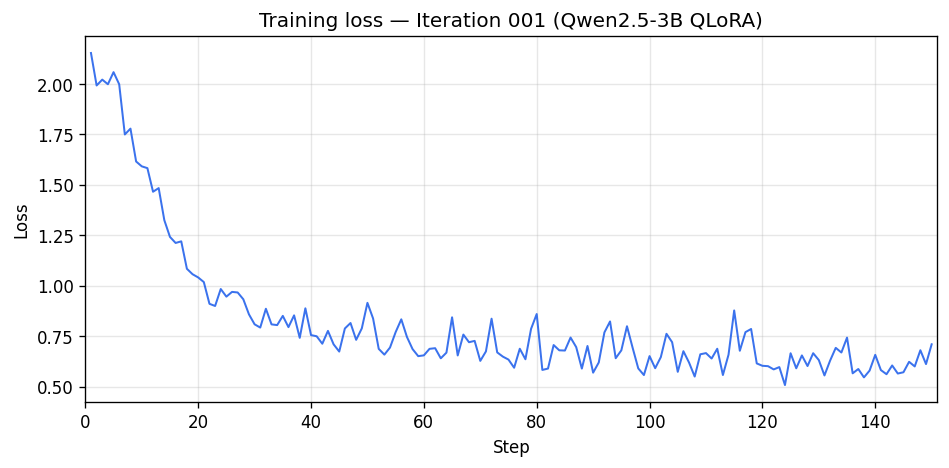
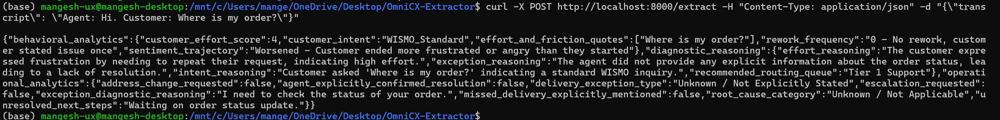

# Training Log — Iteration 001

**Date:** 2025-02-28  
**Status:** Completed  
**Output:** `models/qwen-logistics-lora/`

---

## 1. Environment & setup

| Component | Version / value |
|-----------|------------------|
| **Platform** | WSL (Linux) |
| **Unsloth** | 2026.2.1 |
| **Transformers** | 5.2.0 |
| **PyTorch** | 2.10.0+cu128 |
| **CUDA** | 8.6 |
| **CUDA Toolkit** | 12.8 |
| **Triton** | 3.6.0 |
| **GPU** | NVIDIA GeForce RTX 3070 Ti Laptop, 8 GB VRAM |
| **Num GPUs** | 1 |
| **Bfloat16** | TRUE |
| **Flash Attention** | Xformers = None, FA2 = False |

**Note:** Unsloth reported `regex did not match, patch may have failed` (Unsloth Zoo). Training still completed; worth monitoring in future runs.

---

## 2. Model & data

| Setting | Value |
|---------|--------|
| **Base model** | Qwen/Qwen2.5-3B-Instruct |
| **Quantization** | 4-bit (load_in_4bit) |
| **Unsloth patching** | 36 layers (36 QKV, 36 O, 36 MLP) |
| **EOS** | `<\|im_end\|>` mapped for generation |
| **Dataset** | `data/processed/golden_training_dataset.jsonl` |
| **Num examples** | 486 |
| **Tokenization** | `["text"]`, num_proc=2, ~301 examples/s |
| **Padding** | Padding-free auto-enabled by Unsloth |

Tokenizer PAD/BOS/EOS were aligned with model/generation config (`bos_token_id` set to `None`).

---

## 3. Training configuration

| Hyperparameter | Value |
|----------------|--------|
| **Max sequence length** | 2048 |
| **Total steps** | 150 |
| **Num epochs** | 3 (effective ~2.46) |
| **Batch size per device** | 2 |
| **Gradient accumulation steps** | 4 |
| **Effective batch size** | 8 |
| **Learning rate** | 2e-4 (linear schedule) |
| **Warmup steps** | 5 |
| **Optimizer** | adamw_8bit |
| **Weight decay** | 0.01 |
| **Trainable parameters** | 29,933,568 / 3,115,872,256 (**0.96%**) |

---

## 4. Loss & metrics

- **Initial loss (step 1):** ~2.154  
- **Final step loss:** ~0.71  
- **Training loss (mean):** **0.8211**  
- **Gradient norm:** Generally 0.2–0.4 in the second half of training; no obvious instability.

Loss decreased steadily from ~2.15 to ~0.65–0.75 by step 150, with normal batch-to-batch variation.

### Loss curve

*Generated with `python scripts/plot_iteration_001_loss.py` (data from WSL training logs).*

---

## 5. Runtime & throughput

| Metric | Value |
|--------|--------|
| **Total runtime** | 7,328 s (**~2h 2m 8s**) |
| **Train samples/sec** | 0.164 |
| **Train steps/sec** | 0.02 |
| **Time per step** | ~48.9 s |

---

## 6. Observations

1. **Convergence:** Loss improved from ~2.15 to ~0.82 (mean). No signs of divergence; gradient norms stayed in a reasonable range.
2. **Hardware:** Single RTX 3070 Ti (8 GB) was sufficient for 4-bit QLoRA with batch size 2 and grad accum 4.
3. **Unsloth:** Padding-free and Qwen2 patching applied. One Zoo regex warning; impact unclear.
4. **Dataset size:** 486 examples over 150 steps → ~0.31 epochs per full pass; model saw the data ~2.46 times in total.
5. **Next steps (suggested):**  
   - Run inference on a held-out set (or synthetic transcripts) and compare extracted JSON to ground truth.  
   - Optionally add more data or a second run with more steps and compare train/eval loss if you add a validation split.

---

## 7. Artifacts

- **LoRA adapters & tokenizer:** `models/qwen-logistics-lora/`  
- **Training script:** `src/train.py`  
- **Schema:** `src/schema.py` (LogisticsCXMetrics)

---

*Log generated from WSL terminal output after training completion.*
